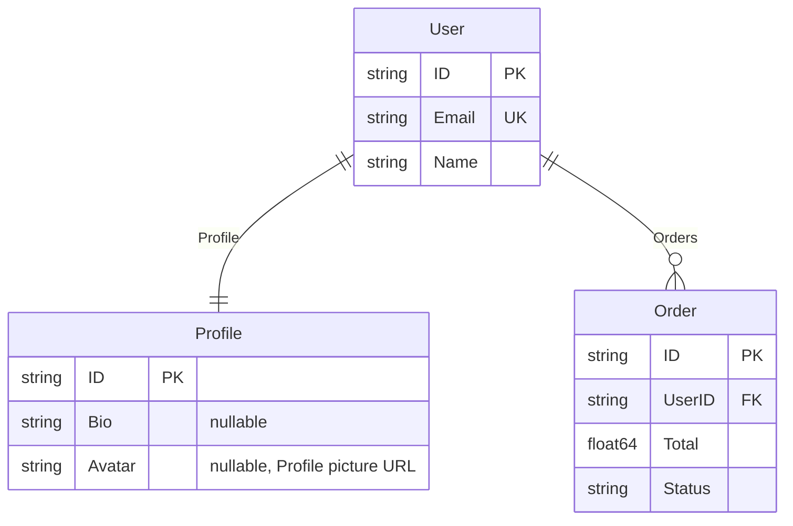

# erd

[](https://github.com/zoobzio/erd/actions/workflows/ci.yml)
[](https://codecov.io/gh/zoobzio/erd)
[](https://goreportcard.com/report/github.com/zoobzio/erd)
[](https://github.com/zoobzio/erd/security/code-scanning)
[](https://pkg.go.dev/github.com/zoobzio/erd)
[](LICENSE)
[](go.mod)
[](https://github.com/zoobzio/erd/releases)

Go package for generating Entity Relationship Diagrams from domain models.

## Installation

```bash
go get github.com/zoobzio/erd
```

## Example

Define your domain models with `erd` struct tags:

```go
package main

import (
    "fmt"

    "github.com/zoobzio/erd"
    "github.com/zoobzio/sentinel"
)

type User struct {
    ID      string   `erd:"pk"`
    Email   string   `erd:"uk"`
    Name    string
    Profile *Profile
    Orders  []Order
}

type Profile struct {
    ID     string  `erd:"pk"`
    Bio    *string
    Avatar *string `erd:"note:Profile picture URL"`
}

type Order struct {
    ID     string  `erd:"pk"`
    UserID string  `erd:"fk"`
    Total  float64
    Status string
}

func main() {
    // Scan types to extract metadata
    sentinel.Scan[User]()

    // Generate ERD from schema
    diagram := erd.FromSchema("User Domain", sentinel.Schema())

    // Output as Mermaid
    fmt.Println(diagram.ToMermaid())
}
```

This produces the following diagram:



## Struct Tags

The `erd` tag supports:

| Tag | Description |
|-----|-------------|
| `pk` | Primary key |
| `fk` | Foreign key |
| `uk` | Unique key |
| `note:...` | Attribute note |

Tags can be combined: `erd:"pk,note:Auto-generated UUID"`

## Relationships

Relationships are inferred from struct fields:

| Field Type | Cardinality |
|------------|-------------|
| `*T` (pointer) | One-to-one |
| `[]T` (slice) | One-to-many |
| `T` (embedded) | One-to-one |
| `map[K]V` | Many-to-many |

## Output Formats

### Mermaid

```go
mermaid := diagram.ToMermaid()
```

### GraphViz DOT

```go
dot := diagram.ToDOT()
```

## Manual Construction

For cases where you need more control:

```go
diagram := erd.NewDiagram("E-commerce").
    WithDescription("Shopping cart domain model")

product := erd.NewEntity("Product").
    AddAttribute(erd.NewAttribute("ID", "string").WithPrimaryKey()).
    AddAttribute(erd.NewAttribute("Name", "string")).
    AddAttribute(erd.NewAttribute("Price", "float64"))

cart := erd.NewEntity("Cart").
    AddAttribute(erd.NewAttribute("ID", "string").WithPrimaryKey()).
    AddAttribute(erd.NewAttribute("UserID", "string").WithForeignKey())

diagram.
    AddEntity(product).
    AddEntity(cart).
    AddRelationship(erd.NewRelationship("Cart", "Product", "Items", erd.ManyToMany))
```

## Validation

```go
errors := diagram.Validate()
for _, err := range errors {
    fmt.Println(err.Error())
}
```

## License

MIT
